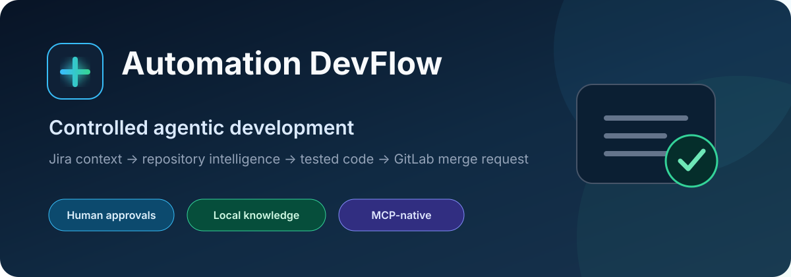
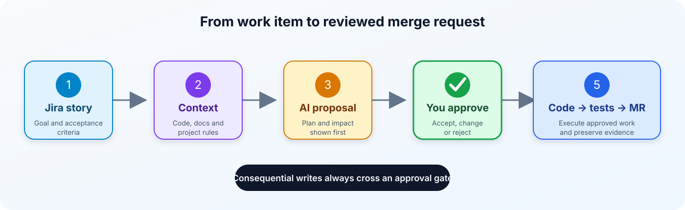
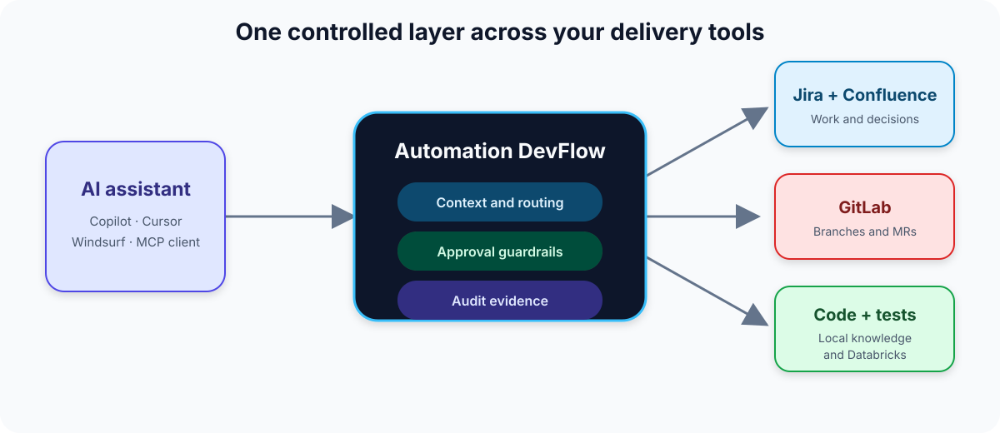

# 🤖 Automation DevFlow — Controlled Agentic Development

> Drop this folder into **any** Git repo. One command later, your AI assistant (Copilot, Windsurf, Cursor) has full Jira, GitLab, Databricks, and code-search superpowers — with guardrails so it never writes without your approval.

<p align="center">
  
</p>

---

## ✨ What this does

| Tool | What the AI can do |
|------|--------------------|
| **jira-mcp** | Read stories, refine descriptions, create/update/bootstrap feature stories, manage subtasks |
| **gitlab-mcp** | List branches, create branches, inspect MRs, safely create MRs with token health checks |
| **dev-mcp** | Full story implementation workflow: codebase scan → Jira update → code → tests → MR |
| **databricks-custom** | SQL queries, job runs, pipeline management, dashboards, vector search |
| **review-mcp** | Code review feedback routing |
| **test-mcp** | Targeted test execution and result analysis |

**Every write action requires explicit user approval before executing.**

## 🔄 End-to-end workflow

<p align="center">
  
</p>

The assistant gathers context and prepares a proposal first. Code changes and external writes happen only after the user reviews the intended action.

## ✨ Live animated architecture

<p align="center">
  <a href="https://subham1997007.github.io/Automation/automation-routing-diagram_full.html">
    
  </a>
</p>

<p align="center">
  <a href="https://subham1997007.github.io/Automation/automation-routing-diagram_full.html"><strong>▶ Open the full-screen animated routing diagram</strong></a>
</p>

Follow the moving routes from setup and Jira context through approval gates, implementation, testing, review, GitLab, and optional Databricks tools.

---

## 🚀 Quick start (any repo)

```bash
# 1. Copy the Automation folder into your repo root
cp -r Automation/ /path/to/your-repo/

# 2. Set up credentials
cd /path/to/your-repo
cp Automation/.env.local.example Automation/.env.local
# Edit Automation/.env.local with your Jira/GitLab credentials

# 3. Run one-time install (creates venv, builds indexes, auto-detects project)
bash Automation/install.sh

# 4. Reload your IDE — AI now has MCP tools available
```

**That's it.** No manual MCP config. The install script auto-detects your project type (Spring Boot, React, Django, Go, Rust…) and generates `AGENTS.md` + `.github/copilot-instructions.md` automatically.

---

## 📁 Folder structure

```
Automation/
├── install.sh                  ← one-command setup for any project
├── bootstrap.sh                ← incremental memory refresh
├── .env.local.example          ← credentials template (copy → .env.local)
├── mcp-servers/
│   ├── jira-mcp/               ← Jira read/write with guardrails
│   ├── gitlab-mcp/             ← GitLab branch + MR management
│   ├── dev-mcp/                ← full story implementation workflow
│   ├── databricks-custom/      ← Databricks SQL, jobs, pipelines
│   ├── review-mcp/             ← code review routing
│   └── test-mcp/               ← test execution
├── scripts/
│   ├── setup_project.py        ← auto-detects project, writes AGENTS.md
│   ├── refresh_memory.py       ← incremental Confluence + codebase cache
│   ├── repo_graph.py           ← knowledge graph builder
│   ├── build_turbovec_index.py ← semantic code search index (turbovec)
│   └── search_turbovec_index.py← query the search index
├── agents/                     ← agent config per MCP server
├── config/                     ← MCP tool registry
├── docs/                       ← routing diagrams + analytics
└── .memory/                    ← auto-generated cache (git-ignored)
```

---

## 🔒 How guardrails work

<p align="center">
  
</p>

**AI never writes to Jira, GitLab, or Databricks without your explicit approval.**

---

## ⚙️ What gets auto-generated

After `bash Automation/install.sh`:

| File | What it contains |
|------|-----------------|
| `AGENTS.md` | Project-specific coding rules (auto-detected from your stack) |
| `.github/copilot-instructions.md` | MCP routing gates for your AI assistant |
| `Automation/.memory/codebase-index.json` | Knowledge graph of your repo |
| `Automation/.memory/code-index.tvim` | turbovec semantic search index (~128 KB) |

All generated files are **git-ignored** — they rebuild automatically on each machine.

---

## 🔧 Credentials required

Copy `.env.local.example` → `.env.local` and fill in:

| Variable | Required | What it's for |
|----------|----------|--------------|
| `JIRA_BASE_URL` | ✅ | Your Jira instance URL |
| `JIRA_USERNAME` | ✅ | Your Jira email |
| `JIRA_API_TOKEN` | ✅ | Jira API token |
| `GITLAB_BASE_URL` | ✅ | Your GitLab instance URL |
| `GITLAB_TOKEN` | ✅ | GitLab personal access token |
| `GITLAB_PROJECT_ID` | ✅ | Your project's numeric ID |
| `CONFLUENCE_BASE_URL` | ⬜ | Confluence base URL (for ADR caching) |
| `CONFLUENCE_SPACE_KEY` | ⬜ | Your Confluence space key |
| `DATABRICKS_HOST` | ⬜ | Databricks workspace URL |
| `DATABRICKS_TOKEN` | ⬜ | Databricks personal access token |
| `OPENAI_API_KEY` | ⬜ | Enables LLM-powered AC and MR description generation |

---

## 💡 Usage examples

### Implement a Jira story end-to-end
```
# In Copilot / Windsurf — just say:
"Implement PROJ-123"

# The AI will:
# 1. Read the story + feature context from Jira
# 2. Scan your codebase for relevant files
# 3. Propose a Jira description update → ask your approval
# 4. Make code changes → ask your approval
# 5. Run targeted tests autonomously
# 6. Create GitLab MR → ask your approval
```

### Bootstrap feature stories
```
"Create stories for feature PROJ-100"

# The AI will:
# 1. Learn the feature goal from Jira
# 2. Discover existing child stories
# 3. Read Confluence ADRs for context
# 4. Generate a sprint-wise story plan → show preview
# 5. Create stories only after your approval
```

### Semantic code search
```bash
python3 Automation/scripts/search_turbovec_index.py "approval gate guardrail"
# → finds top 5 relevant files in <100ms across your entire Automation folder
```

---

## 🧠 How the memory system works

```
install.sh runs once:
  → scans all source files → TF-IDF embeddings → turbovec SIMD index (128 KB)
  → builds repo knowledge graph → codebase-index.json

On every bootstrap.sh:
  → Confluence pages refreshed if >24h old
  → codebase graph rebuilt if >7 days old
  → turbovec index auto-rebuilt when memory changes
  → Jira cache evicted (1h TTL)

AI agent search:
  "jira guardrail" → turbovec.search() → top 5 files in <50ms
  (no API calls, no full file reads, just the index)
```

---

## 📋 Requirements

- **Python 3.10+**
- **Git**
- Jira API token (Atlassian or self-hosted)
- GitLab personal access token

Everything else (venv, dependencies, indexes) is installed automatically by `install.sh`.

---

## 🤝 Contributing

Pull requests welcome. The framework is designed to be:
- **Tool-agnostic** — works with Copilot, Windsurf, Cursor, or any MCP-compatible AI
- **Stack-agnostic** — auto-detects Spring Boot, React, Django, Go, Rust, etc.
- **Org-agnostic** — all company-specific values come from `.env.local`

---

## 📄 License

MIT
