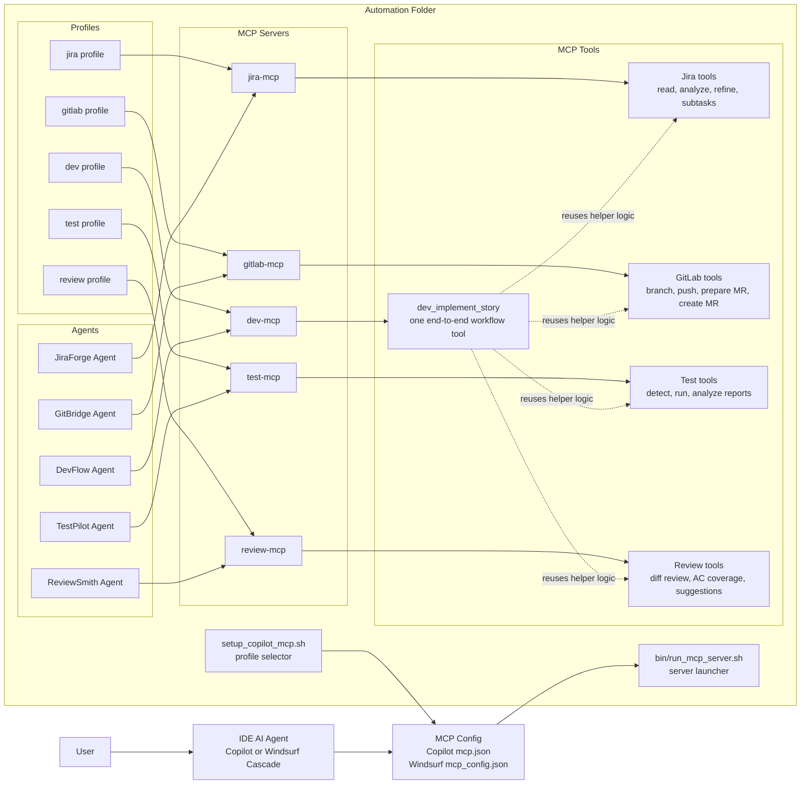
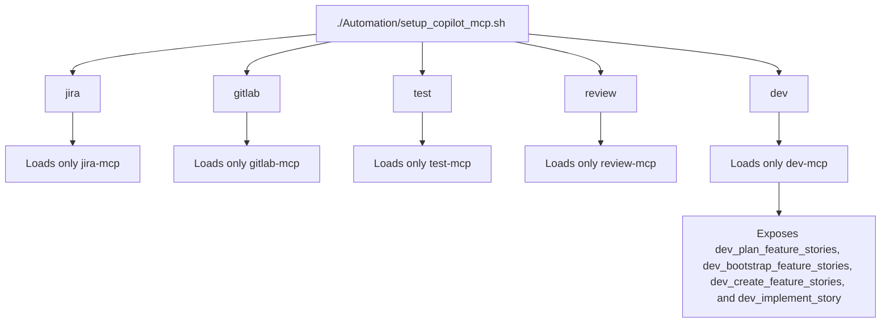
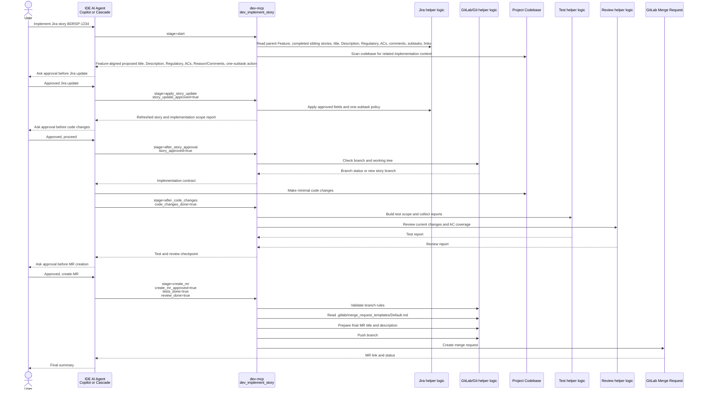
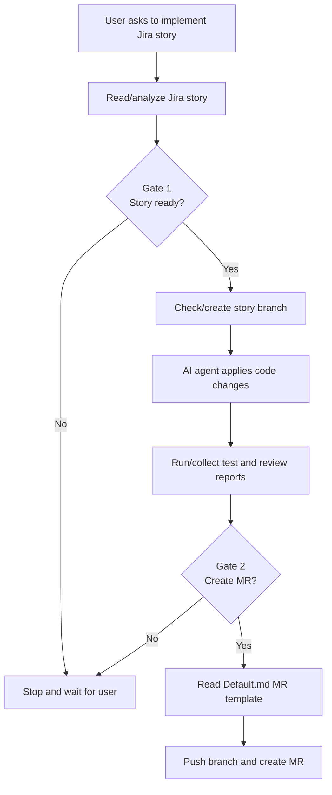

# Controlled Agentic Development

This document explains how the Automation folder enables controlled development acceleration through AI agents, MCP servers, MCP tools, approval gates, and guided request flow.

## High-Level Architecture

## Profile Mapping

## DevFlow End-To-End Request Processing

## DevFlow Approval Gates

## Important Rules

1. When the `dev` profile is selected, Copilot gets one entry point: `dev-mcp` with the `dev_implement_story` tool. This keeps the workflow simple and avoids exposing unrelated tools.
2. DevFlow first reads the full Jira story and scans the codebase before proposing any Jira writing.
3. DevFlow does not update Jira until the user approves the proposed Description, Acceptance Criteria, Regulatory Justification, and one-subtask action.
4. If no subtask exists, DevFlow creates exactly one subtask. If any subtask exists, DevFlow updates one existing subtask and does not create a new one.
5. After approved Jira updates, DevFlow asks for approval to start code changes.
6. DevFlow does not create a merge request until the implementation is complete, tests have been run, review has been performed, and the user gives final approval.
7. The merge request description must be prepared from the project template at `.gitlab/merge_request_templates/Default.md`, so every MR follows the team's standard format.
8. Merge request creation is blocked from unsafe or unclear branches, including `review`, `temp`, `wip`, base branches, or branches that do not match the Jira story key.
9. DevFlow is the orchestrator. Internally, it reuses the focused helper logic from JiraForge, GitBridge, TestPilot, and ReviewSmith instead of duplicating those responsibilities.
